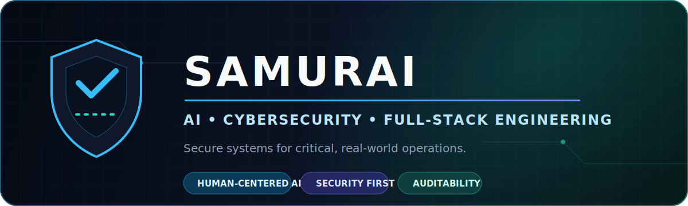
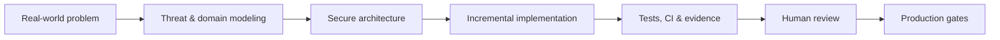

<div align="center">



### Building secure, intelligent systems for operations where trust matters.

[](mailto:samurai@n3xus.dev)
[](https://github.com/Samurai33)
[](https://github.com/Samurai33)

</div>

## `whoami`

I am **Samurai**, an AI, cybersecurity and full-stack engineer working at the
intersection of software, security and critical operations.

My work is centered on products that must do more than look impressive:
they need clear authority boundaries, reliable data flows, human oversight,
traceable decisions and a realistic path to production.

```text
Focus       Secure AI · Cybersecurity · SaaS · Data Governance
Domains     Aviation · Pentesting · Sustainable Infrastructure
Approach    Security-first · Evidence-driven · Human-in-the-loop
Building    N3xus D3v
```

## Flagship systems

These are the projects that best represent how I think and build.

<table>
  <tr>
    <td width="50%" valign="top">
      <h3>✈️ Ops Log AI</h3>
      <p><strong>AI-assisted aviation operations platform</strong></p>
      <p>Transforms flight logs, fuel receipts and maintenance images into structured records with human review, auditability and privacy-by-design.</p>
      <p>
        
        
        
        
      </p>
      <p><strong>Engineering:</strong> authenticated APIs, billing validation, Firebase isolation, AI resilience, automated tests and CI.</p>
      <p><a href="https://opslog.n3xus.dev/"><strong>Open product ↗</strong></a> · Private source · Active development</p>
    </td>
    <td width="50%" valign="top">
      <h3>🛡️ CPTS Report AI Enterprise</h3>
      <p><strong>Self-hosted penetration testing workspace</strong></p>
      <p>Unifies authorized scope, evidence, vulnerability findings, CVSS scoring, compliance mapping and AI-assisted report generation.</p>
      <p>
        
        
        
        
      </p>
      <p><strong>Security:</strong> authorized-use boundaries, evidence confidence, classification, remediation tracking and human-reviewed AI.</p>
      <p><a href="https://cpts.cloud.n3xus.dev/"><strong>Open live workspace ↗</strong></a> · Private source</p>
    </td>
  </tr>
  <tr>
    <td width="50%" valign="top">
      <h3>🔎 CEAP Security Assessment 2026</h3>
      <p><strong>Authorized recon and vulnerability assessment</strong></p>
      <p>A structured security engagement covering scope control, passive and active reconnaissance, attack-surface mapping, evidence handling and remediation planning.</p>
      <p>
        
        
        
      </p>
      <p><strong>Deliverables:</strong> sanitized evidence, integrity hashes, risk matrix, technical report, findings audit and remediation roadmap.</p>
      <p>Confidential engagement · Defensive and authorized use only</p>
    </td>
    <td width="50%" valign="top">
      <h3>🌱 GreenPulse</h3>
      <p><strong>Sustainable datacenter intelligence</strong></p>
      <p>Interactive monitoring for energy, carbon impact, server health, SRE signals and idle-resource optimization in critical infrastructure.</p>
      <p>
        
        
        
      </p>
      <p><strong>Product:</strong> operational dashboards, alerts, reports, resource marketplace and explicit demo-data boundaries.</p>
      <p><a href="https://github.com/Samurai33/GreenPulse"><strong>Repository ↗</strong></a> · <a href="https://greenpulse-pi.vercel.app"><strong>Live demo ↗</strong></a></p>
    </td>
  </tr>
</table>

## Public case studies

| Project | Signal | What it demonstrates |
| --- | --- | --- |
| [**CyberJustice Brasil**](https://github.com/Samurai33/CyberJust) · [Live](https://v0-cyber-justica.vercel.app) | Cybersecurity product experience | Responsive information architecture for cybercrime cases, protocols, specialists and digital-safety education. |
| [**Data Sentinel**](https://github.com/Samurai33/delduque-data-sentinel) | Data security and LGPD | Python dashboard for sensitive-data analysis with Google Drive integration, Plotly visualization and Docker delivery. |
| [**VoltEra Nexus**](https://github.com/Samurai33/VoltEra-Nexus-The-Energy-Consciousness-Protocol) | Creative technology | Interactive experience connecting decentralized infrastructure, clean energy, digital art and product storytelling. |

> Public prototypes are presented as case studies. Production readiness is stated
> explicitly inside each project rather than implied by polished UI.

## How I engineer



- **Security before spectacle** — authentication, authorization, isolation and
  sensitive-data handling are architectural concerns.
- **AI assists; humans remain accountable** — uncertain output stays explicit,
  reviewable and correctable.
- **Evidence over claims** — tests, CI, documentation, screenshots, hashes and
  known limitations support the story.
- **Domain context matters** — aviation, pentesting and infrastructure products
  require different failure models.
- **Production is a gate, not a vibe** — a working demo is not automatically a
  production-ready system.

## Technology map

| Layer | Tools |
| --- | --- |
| **Frontend** | TypeScript, React, Next.js, Vite, Tailwind CSS, shadcn/ui, Motion |
| **Backend & APIs** | Node.js, Express, Python, FastAPI, REST, webhooks |
| **AI & Data** | Gemini, LLM integrations, Pandas, Plotly, structured extraction |
| **Cloud & Platform** | Firebase, Supabase, Docker, Google Cloud, Azure, Vercel |
| **Security** | Threat modeling, OWASP practices, CVSS, recon, evidence integrity, LGPD |
| **Delivery** | Git, GitHub Actions, automated tests, CI/CD, technical documentation |

<div align="center">
  
</div>

## GitHub signal

<div align="center">
  
  
</div>

<sub>Language cards reflect public repositories and do not represent proficiency by themselves.</sub>

## Beyond the terminal

I am also a **helicopter flight instructor** and **DJ**. Aviation reinforces
checklists, risk awareness and calm decision-making; music sharpens timing,
adaptation and the ability to read a live system. Both influence how I build.

---

<div align="center">

### Let us build something trustworthy.

AI products · Cybersecurity · Aviation technology · Data governance · Sustainable infrastructure

[](mailto:samurai@n3xus.dev)

</div>
