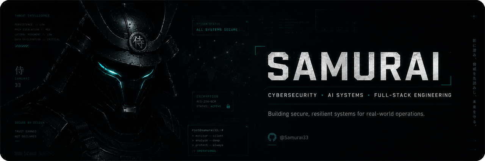

<div align="center">



### Building secure, intelligent systems for operations where trust matters.

[](https://n3xus.dev)
[](mailto:samurai@n3xus.dev)
[](https://github.com/Samurai33/CyberJust/commits/main)

</div>

```console
$ whoami
Samurai — AI, cybersecurity & full-stack engineer · founder @N3xusD3v · São Paulo, BR

$ cat focus.txt
Secure AI · AppSec & Pentesting · SaaS · Data Governance (LGPD)

$ cat domains.txt
Aviation ops · Offensive security · Sustainable infrastructure

$ cat principles.txt
Security-first · Evidence-driven · Human-in-the-loop
```

## Proof, not promises

Public repositories where the engineering can be inspected end-to-end.

| Project | What you can verify in the repo |
|---|---|
| **[CyberJust](https://github.com/Samurai33/CyberJust)** · [live ↗](https://v0-cyber-justica.vercel.app) | Next.js + TypeScript · Vitest unit tests · Playwright E2E · 2 CI workflows · `SECURITY.md` · 140+ issues/PRs with conventional commits · rate-limiter XFF-bypass fix & hardened security headers |
| **[GreenPulse](https://github.com/Samurai33/GreenPulse)** · [live ↗](https://greenpulse-pi.vercel.app) | React + Vite · CI pipeline · `SECURITY.md` / `CONTRIBUTING.md` · dependency-vulnerability remediation · explicit demo-data boundaries |
| **[Data Sentinel](https://github.com/Samurai33/delduque-data-sentinel)** | Python · LGPD sensitive-data analysis · Google Drive integration · Plotly · Docker delivery |

## Flagship systems (private source)

Production work under client or product confidentiality. Architecture walkthroughs available on request.

**✈️ Ops Log AI** — AI-assisted aviation operations platform · [open product ↗](https://opslog.n3xus.dev)
Turns flight logs, fuel receipts and maintenance images into structured, human-reviewed records.
`authenticated APIs` `billing validation` `Firebase isolation` `AI resilience` `CI`

**🛡️ CPTS Report AI Enterprise** — self-hosted penetration-testing workspace · [live workspace ↗](https://cpts.cloud.n3xus.dev)
Authorized scope, evidence, findings, CVSS scoring, compliance mapping and human-reviewed AI reporting.
`authorized-use boundaries` `evidence confidence` `remediation tracking`

**🔎 Public-sector security assessment (2026)** — authorized recon & vulnerability assessment
Scope control, attack-surface mapping, sanitized evidence with integrity hashes, risk matrix and remediation roadmap.
`defensive & authorized use only`

## Now shipping

<!-- SHIPPING:START -->
| Repository | What it is | Stack | Last push |
|---|---|---|---|
| [hotlead](https://github.com/Samurai33/hotlead) | plataforma para Scrapp de Leads quentes | Python | 3d ago |
| [CyberJust](https://github.com/Samurai33/CyberJust) | Cybersecurity media and education experience exploring Brazilian cybercrime cases, specialists and digital protection. | TypeScript | 17d ago |
| [GreenPulse](https://github.com/Samurai33/GreenPulse) | Sustainable datacenter monitoring for energy, carbon impact, SRE health and idle-resource optimization. | TypeScript | 1mo ago |
| [VoltEra-Nexus-The-Energy-Consciousness-Protocol](https://github.com/Samurai33/VoltEra-Nexus-The-Energy-Consciousness-Protocol) | Interactive digital-art experience connecting clean energy, decentralized infrastructure and speculative technology. | TypeScript | 3mo ago |
| [MRP](https://github.com/Samurai33/MRP) | Public architecture, documentation and reference assets for the Marola RP FiveM roleplay ecosystem. | JavaScript | 3mo ago |
<!-- SHIPPING:END -->

## How I engineer

- **Security before spectacle** — authentication, authorization, isolation and sensitive-data handling are architectural concerns.
- **AI assists; humans remain accountable** — uncertain output stays explicit, reviewable and correctable.
- **Evidence over claims** — tests, CI, docs, hashes and known limitations carry the story.
- **Domain context matters** — aviation, pentesting and infrastructure have different failure models.
- **Production is a gate, not a vibe** — a working demo is not a production-ready system.

<details>
<summary><b>Technology map</b></summary>
<br>

| Layer | Tools |
|---|---|
| Frontend | TypeScript, React, Next.js, Vite, Tailwind CSS, shadcn/ui, Motion |
| Backend & APIs | Node.js, Express, Python, FastAPI, REST, webhooks |
| AI & Data | Gemini, LLM integrations, structured extraction, Pandas, Plotly |
| Cloud & Platform | Firebase, Supabase, Docker, Google Cloud, Azure, Vercel, self-hosted homelab |
| Security | Threat modeling, OWASP ASVS/Top 10, CVSS, recon, evidence integrity, LGPD |
| Delivery | Git, GitHub Actions, Vitest, Playwright, CI/CD, technical documentation |

<p align="center">
  
</p>
</details>

## Activity

<picture>
  <source media="(prefers-color-scheme: dark)" srcset="metrics/contributions-dark.svg" />
  <source media="(prefers-color-scheme: light)" srcset="metrics/contributions.svg" />
  
</picture>

## Beyond the terminal

Helicopter flight instructor and DJ. Aviation reinforces checklists, risk awareness and calm decision-making; music sharpens timing and the ability to read a live system. Both shape how I build.

<div align="center">

**Let's build something trustworthy.** → [samurai@n3xus.dev](mailto:samurai@n3xus.dev)

<sub>AI products · Cybersecurity · Aviation technology · Data governance · Sustainable infrastructure</sub>

</div>
